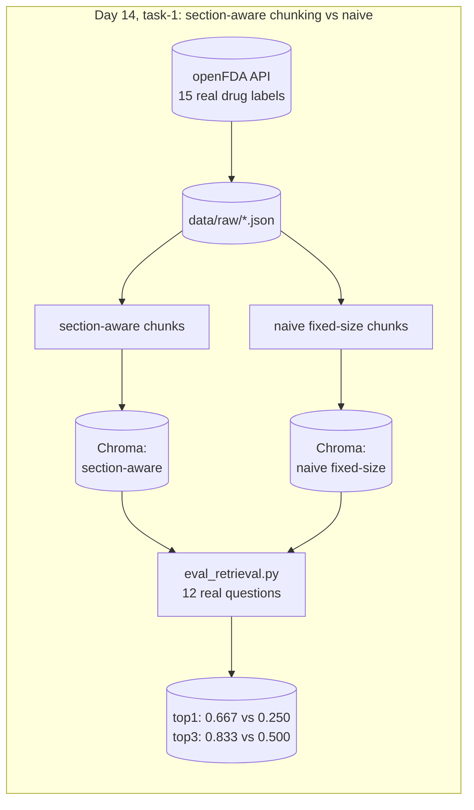

# RxGround

Clinical drug-reference RAG for a pharmacist looking up FDA-approved drug
labeling data instead of digging through PDFs. Phase 4 of a 30-day
production AI/ML engineering roadmap (see
`30-day-ai-ml-roadmap-industry-portfolio.md` at the repo root), following
GridScribe. Own git repo, own virtual environment, own DVC setup, separate
from FleetPulse's and GridScribe's.

Why this industry pairs with RAG, pharmacy is a clear case for why RAG
needs to be grounded and citation-enforced, a wrong drug interaction answer
is a safety incident, not just a bad user experience. The data is also
genuinely, safely public, FDA drug labeling contains no patient information
at all.

## Architecture



## Tasks

| Day | Folder | What it is |
|---|---|---|
| 14 | [`task-1/`](./task-1) | Indexes 15 real FDA drug labels (pulled live from the openFDA API) two ways, section-aware chunking versus naive fixed-size chunking, embeds both with BAAI/bge-base-en-v1.5 into separate Chroma collections, and measures the real retrieval accuracy gap on 12 pharmacist-style questions. Section-aware wins 0.667 versus 0.250 top-1 accuracy on the same questions |

## Tech stack

Click a tool to see what it is used for, and why that one, when there is a
specific reason beyond "it is the roadmap's named default."

<details>
<summary><strong>openFDA drug labeling API</strong>, task-1, source of every drug label indexed</summary>

Public, free, no API key required. Chosen over scraping PDFs because it is
structured, government-published, and genuinely current, and because FDA
labels carry no patient information, so there is no privacy handling to
build for this dataset.
</details>

<details>
<summary><strong>Pydantic</strong>, task-1, the <code>LabelChunk</code> schema and its <code>LabelSection</code> enum</summary>

Same library used across FleetPulse and GridScribe for this repo family.
Rejects a chunk with empty text or an invalid section name before it ever
reaches the embedding step, rather than silently indexing garbage.
</details>

<details>
<summary><strong>sentence-transformers, BAAI/bge-base-en-v1.5</strong>, task-1, turns label text into searchable embeddings</summary>

The specific model the roadmap names for this task. Free, open, and runs
locally, no per-call cost or API key, which matters for indexing hundreds
of label sections.
</details>

<details>
<summary><strong>Chroma</strong>, task-1, stores and searches the two embedding collections</summary>

Picked over the roadmap's other listed option, Qdrant, because it needs no
server or account for a dataset this size, a local folder is enough. Keeps
the day's work focused on the chunking comparison itself, not on running
infrastructure.
</details>

<details>
<summary><strong>DVC + a local Floci S3 bucket</strong>, task-1, versions the 15 raw label JSON files</summary>

Same pattern as FleetPulse and GridScribe: DVC keeps large or frequently
regenerated data out of git history, and Floci is a local AWS emulator, so
this costs nothing and needs no real AWS account.
</details>

<details>
<summary><strong>pytest</strong>, task-1, schema and chunking tests</summary>

Tests run against small inline fixture data, not the real DVC-tracked
labels, on purpose, so they stay fast and work in CI without needing
`dvc pull` or network access.
</details>

<details>
<summary><strong>mermaid-cli, via GitHub Actions</strong>, every README's diagram</summary>

Renders each README's mermaid block through the real parser on every push,
so a diagram that looks fine as plain text but breaks GitHub's renderer
fails the build instead of only showing up broken after merging.
</details>

## Setup

```bash
cd rxground
python3 -m venv .venv
./.venv/bin/pip install -r requirements.txt
cd task-1
../.venv/bin/dvc pull
../.venv/bin/python index.py
../.venv/bin/python eval_retrieval.py
```
