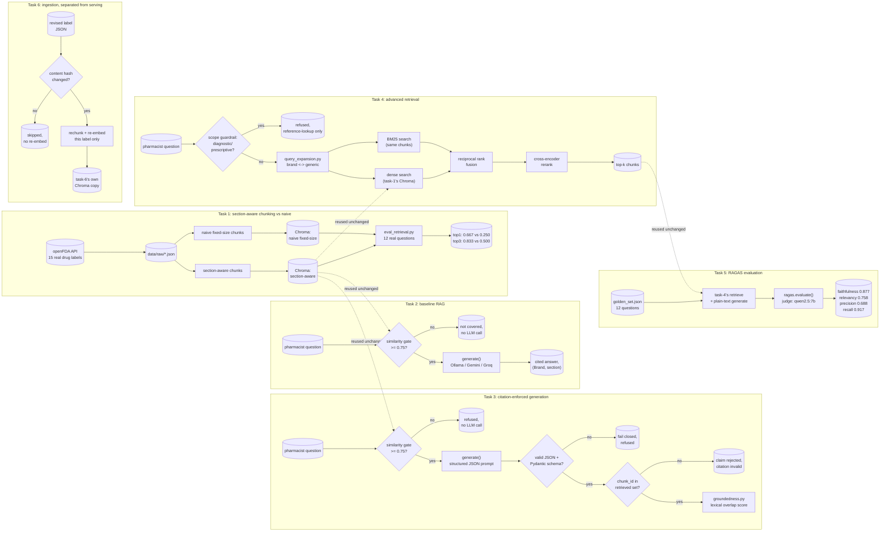

# RxGround

Clinical drug-reference RAG for a pharmacist looking up FDA-approved drug
labeling data instead of digging through PDFs. Phase 4 of a 30-day
production AI/ML engineering roadmap (see
`30-day-ai-ml-roadmap-industry-portfolio.md` at the repo root), following
GridScribe. Own git repo, own virtual environment, own DVC setup, separate
from FleetPulse's and GridScribe's.

Why this industry pairs with RAG, pharmacy is a clear case for why RAG
needs to be grounded and citation-enforced, a wrong drug interaction answer
is a safety incident, not just a bad user experience. The data is also
genuinely, safely public, FDA drug labeling contains no patient information
at all.

## PII/PHI and HIPAA, honestly

RxGround's data source, openFDA drug labeling, contains no patient
information by definition, it is regulatory text about a drug, not a
person. That means HIPAA does not apply to the data this system indexes,
the same way it wouldn't apply to a paper drug reference book.

The real gap is the **input**, not the index: nothing here stops a
pharmacist from typing patient-identifying details into a free-text
question (a name, a date of birth), which would then reach whichever LLM
provider answered it and, unredacted, land in this repo's logged eval
outputs. task-4's [scope guardrail](./task-4/scope_guardrail.py) blocks
diagnostic/prescriptive phrasing, it does not detect or redact PII, that
is a deliberately separate concern this project does not build, since
RxGround was scoped as reference lookup over public label data, not a
system meant to receive real patient data in the first place.

If RxGround (or a system like it) needed to actually handle real PHI, the
real requirements would be: PII/PHI detection and redaction before a
query reaches any LLM provider or gets logged, a signed BAA with every
LLM vendor used (Groq's and Gemini's free tiers do not offer one, ruling
them out as-is), encryption at rest and in transit for logs, access
controls, and audit logging. None of that is built here. This is the
same reason CareThread, the roadmap's capstone, uses **Synthea**-generated
fully synthetic patient records instead of real data, the same
architectural story, RAG plus PHI-shaped data plus guardrails, with zero
real PHI and therefore zero HIPAA obligation.

## Architecture



Task 6's ingestion writes to its own, separate Chroma copy
(`task-6/chroma_db/`), never to task-1's collection every serving task
(2, 3, 4) reads from, see task-6's own README for why.

## Tasks

| Task | Folder | What it is |
|---|---|---|
| 1 | [`task-1/`](./task-1) | Indexes 15 real FDA drug labels (pulled live from the openFDA API) two ways, section-aware chunking versus naive fixed-size chunking, embeds both with BAAI/bge-base-en-v1.5 into separate Chroma collections, and measures the real retrieval accuracy gap on 12 pharmacist-style questions. Section-aware wins 0.667 versus 0.250 top-1 accuracy on the same questions |
| 2 | [`task-2/`](./task-2) | Baseline RAG on top of task-1's index: retrieve, augment, generate with a citation-enforcing prompt and a measured 0.75 similarity gate that refuses questions not covered by the indexed labels before any LLM call. 10/10 real questions were gated correctly, 6/8 in-index answers carried a traceable citation (4/8 in the exact requested format, 2 more in the label's own cross-reference style), and 2/2 out-of-index questions were correctly refused, run live against Ollama and confirmed provider-agnostic against Gemini |
| 3 | [`task-3/`](./task-3) | Citation-enforced generation: structured JSON output, one claim per statement, each claim's `(set_id, section, chunk_id)` citation validated first by Pydantic then cross-checked against the chunk_ids actually retrieved for that question, a claim whose citation does not survive both checks is rejected rather than trusted. A lexical-overlap groundedness score is logged per claim. Run live against Ollama on 18 questions across 3 categories: 10/10 refusal correctness, 0.556 mean citation validity on answered questions, 0.749 mean groundedness, 0/18 parse failures. The real citation-invalid cases were content-correct answers with a fabricated chunk_id (see task-3's README), which is exactly the failure mode the chunk_id cross-check exists to catch. The deliberate failure exercise shows the citation-enforced pipeline correctly refusing an aspirin dosing question (aspirin is not indexed) while the same retrieved context, unenforced, produces a confident-sounding answer built from an unrelated drug's label |
| 4 | [`task-4/`](./task-4) | Advanced retrieval: hybrid search (BM25 plus task-1's dense vectors) combined with reciprocal rank fusion, cross-encoder reranking, brand/generic query expansion, drug-class metadata filtering (a curated table, openFDA's own class field is populated for only 4 of 15 labels), and a scope guardrail refusing diagnostic/prescriptive questions before retrieval even runs, the missing piece of the roadmap's anti-hallucination task. Run live on 18 real queries: hybrid + rerank improved top-1 accuracy over naive dense-only search (0.778 vs 0.722) but top-3 accuracy dropped slightly (0.833 vs 0.889), a real, traced regression where the reranker promoted a wrong-drug chunk with strong topical overlap over the correct drug's own chunk, documented honestly rather than tuned away |
| 5 | [`task-5/`](./task-5) | RAG evaluation with real RAGAS metrics (faithfulness, answer relevancy, context precision, context recall) over 12 golden questions, judged by Ollama (qwen2.5:7b) and scored with the same BAAI/bge-base-en-v1.5 embeddings task-1 indexes with, no OpenAI key anywhere. Real means: faithfulness 0.877, answer relevancy 0.758, context precision 0.688, context recall 0.917. The honest finding: three questions scored 0.0 on some metric despite their answers being correct on inspection, exposing that a small local judge model produces real judge noise, not just low scores, RAGAS is only as reliable as what judges it. One low score was genuine retrieval signal, not judge noise, the same COZAAR reranker regression task-4 documents, caught independently here by context precision/recall dropping to 0 |
| 6 | [`task-6/`](./task-6) | Production RAG architecture: ingestion separated from serving, orchestrated as a Prefect flow, incremental re-indexing keyed on a per-label content hash so only a changed label's chunks are ever rechunked, re-embedded, and replaced. Real, live simulation: seeded from all 15 real labels, confirmed idempotent on re-run (all 15 hashes unchanged, all skipped), then a simulated ZITUVIMET boxed-warning revision correctly triggered re-ingestion of exactly that one label, confirmed retrievable in the new text, with an unrelated label's chunk_ids byte-identical before and after. Caught and fixed two real bugs along the way (documented in task-6's README): Prefect copies flow parameters across a subflow boundary, so mutating a shared manifest dict silently didn't propagate, and the verification step itself only checked the first of 3 chunks a long section split into, missing the revision on the first run despite ingestion having worked correctly |

## Tech stack

Click a tool to see what it is used for, and why that one, when there is a
specific reason beyond "it is the roadmap's named default."

<details>
<summary><strong>openFDA drug labeling API</strong>, task-1, source of every drug label indexed</summary>

Public, free, no API key required. Chosen over scraping PDFs because it is
structured, government-published, and genuinely current, and because FDA
labels carry no patient information, so there is no privacy handling to
build for this dataset.
</details>

<details>
<summary><strong>Pydantic</strong>, task-1, the <code>LabelChunk</code> schema and its <code>LabelSection</code> enum</summary>

Same library used across FleetPulse and GridScribe for this repo family.
Rejects a chunk with empty text or an invalid section name before it ever
reaches the embedding step, rather than silently indexing garbage.
</details>

<details>
<summary><strong>sentence-transformers, BAAI/bge-base-en-v1.5</strong>, task-1, turns label text into searchable embeddings</summary>

The specific model the roadmap names for this task. Free, open, and runs
locally, no per-call cost or API key, which matters for indexing hundreds
of label sections.
</details>

<details>
<summary><strong>Chroma</strong>, task-1, stores and searches the two embedding collections</summary>

Picked over the roadmap's other listed option, Qdrant, because it needs no
server or account for a dataset this size, a local folder is enough. Keeps
this task focused on the chunking comparison itself, not on running
infrastructure.
</details>

<details>
<summary><strong>DVC + a local Floci S3 bucket</strong>, task-1, versions the 15 raw label JSON files</summary>

Same pattern as FleetPulse and GridScribe: DVC keeps large or frequently
regenerated data out of git history, and Floci is a local AWS emulator, so
this costs nothing and needs no real AWS account.
</details>

<details>
<summary><strong>pytest</strong>, task-1, schema and chunking tests</summary>

Tests run against small inline fixture data, not the real DVC-tracked
labels, on purpose, so they stay fast and work in CI without needing
`dvc pull` or network access.
</details>

<details>
<summary><strong>mermaid-cli, via GitHub Actions</strong>, every README's diagram</summary>

Renders each README's mermaid block through the real parser on every push,
so a diagram that looks fine as plain text but breaks GitHub's renderer
fails the build instead of only showing up broken after merging.
</details>

<details>
<summary><strong>Ollama, qwen2.5:7b</strong>, task-2, the default local generation provider for baseline RAG</summary>

Free, local, no rate limit, which is why every real eval run in task-2's
README uses it. Also the provider on which the citation-format finding
(the model echoes the label's own cross-reference style about as often as
it follows the prompt's requested format) was actually observed.
</details>

<details>
<summary><strong>Gemini, gemini-flash-latest</strong>, task-2, confirmed live as the alternate generation provider</summary>

Run against the same real questions as Ollama specifically to prove the
retrieve-augment-generate pipeline is genuinely provider-agnostic, not
just structured to look that way.
</details>

<details>
<summary><strong>Groq, llama-3.3-70b-versatile</strong>, task-2, one leg of the provider-agnostic generation step</summary>

Wired identically to the other two providers, but not exercised live, no
<code>GROQ_API_KEY</code> is set in this environment, the same documented gap as
GridScribe.
</details>

<details>
<summary><strong>Pydantic</strong>, task-3, <code>Citation</code>/<code>Claim</code>/<code>GroundedResponse</code> structural validation of the LLM's JSON output</summary>

Same library used for task-1's <code>LabelChunk</code> schema, reused here
for a different job, rejecting a claim with no citation or a response
shape that does not match what was asked for, before any citation is
trusted. Necessary but not sufficient on its own, see the chunk_id
cross-check below.
</details>

<details>
<summary><strong>A repo-level chunk_id cross-check</strong>, task-3, catches what Pydantic alone cannot</summary>

Pydantic can confirm a citation has the right shape, it cannot confirm the
cited chunk_id was one that was actually retrieved for the question. This
check does, and it is what caught the real observed failure mode, qwen2.5:
7b giving a factually correct answer while citing a plausible-looking but
fabricated chunk_id, see task-3's README for the exact case.
</details>

<details>
<summary><strong>A lexical-overlap heuristic</strong>, task-3, the groundedness check, deliberately not a second LLM call</summary>

Chosen over LLM-as-judge because the failure being checked for, a claim's
text saying something its cited chunk does not contain, is a fact a
second LLM call could just as easily rubber-stamp as the first one
hallucinated. A deterministic word-overlap score cannot be talked into
agreeing with a fabricated claim.
</details>

<details>
<summary><strong>rank_bm25</strong>, task-4, the BM25 leg of hybrid search</summary>

Small, free, pure-Python BM25 implementation over the exact same
section-aware chunks task-1 already built, no separate search server
needed for a dataset this size.
</details>

<details>
<summary><strong>Reciprocal rank fusion</strong>, task-4, combines BM25 and dense search rankings</summary>

Chosen over a weighted score blend because BM25 scores and cosine
similarity live on incomparable scales, RRF only needs each ranked
list's position, not its raw score, to combine them.
</details>

<details>
<summary><strong>cross-encoder/ms-marco-MiniLM-L-6-v2</strong>, task-4, reranks the fused candidate pool</summary>

The specific reranker the roadmap names for this task, free and
well-established. Also the model on which task-4's real regression was
observed, it can promote a wrong-drug chunk with strong topical overlap
over the right drug's own chunk, since it is not given the drug name as
a separate signal, only raw chunk text, see task-4's README.
</details>

<details>
<summary><strong>A curated drug-class table</strong>, task-4, metadata filtering by drug class</summary>

openFDA's own <code>pharm_class_epc</code> field, the obvious source for
this, is populated for only 4 of the 15 labels indexed here, too sparse
to filter on directly, so this is a small hand-built table instead,
standard pharmacology classification.
</details>

<details>
<summary><strong>RAGAS</strong>, task-5, faithfulness, answer relevancy, context precision, and context recall</summary>

The specific eval library the roadmap names for this task. Wired through
its LangChain wrappers to a local Ollama judge (qwen2.5:7b) and the
same BAAI/bge-base-en-v1.5 embeddings task-1's index uses, no OpenAI key
needed, consistent with every other provider-agnostic piece of this
repo. Also the tool that surfaced this project's most interesting honest
finding, a small local judge model produces real judge noise, three
correct answers scored 0.0 on some metric purely from judge unreliability,
see task-5's README.
</details>

<details>
<summary><strong>Prefect</strong>, task-6, orchestrates ingestion as its own flow, separate from serving</summary>

Picked over the roadmap's other listed option, Dagster, for a
decorator-based flow/task API that keeps the incremental-ingestion logic
readable, and because this repo needs simple retry-on-failure semantics
per label, not Dagster's heavier asset-based data-lineage model, which
would be more than this dataset's size actually needs.
</details>

## Setup

```bash
cd rxground
python3 -m venv .venv
./.venv/bin/pip install -r requirements.txt
cd task-1
../.venv/bin/dvc pull
../.venv/bin/python index.py
../.venv/bin/python eval_retrieval.py
```
