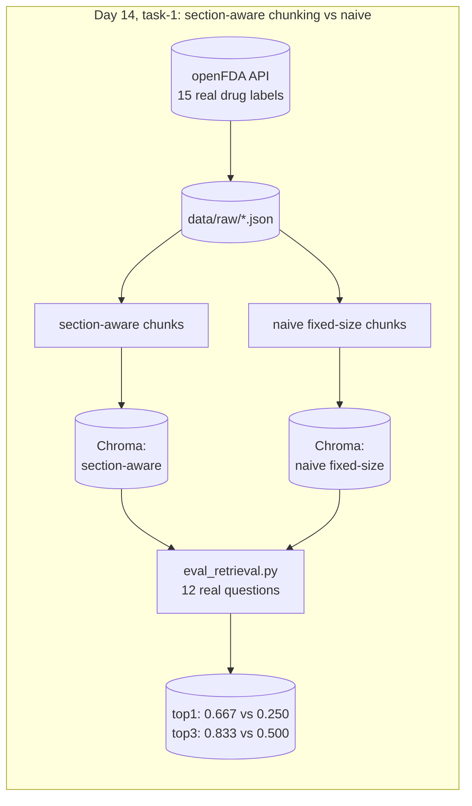

# RxGround

Clinical drug-reference RAG for a pharmacist looking up FDA-approved drug
labeling data instead of digging through PDFs. Phase 4 of a 30-day
production AI/ML engineering roadmap (see
`30-day-ai-ml-roadmap-industry-portfolio.md` at the repo root), following
GridScribe. Own git repo, own virtual environment, own DVC setup, separate
from FleetPulse's and GridScribe's.

Why this industry pairs with RAG, pharmacy is a clear case for why RAG
needs to be grounded and citation-enforced, a wrong drug interaction answer
is a safety incident, not just a bad user experience. The data is also
genuinely, safely public, FDA drug labeling contains no patient information
at all.

## Architecture



## Tasks

| Day | Folder | What it is |
|---|---|---|
| 14 | [`task-1/`](./task-1) | Indexes 15 real FDA drug labels (pulled live from the openFDA API) two ways, section-aware chunking versus naive fixed-size chunking, embeds both with BAAI/bge-base-en-v1.5 into separate Chroma collections, and measures the real retrieval accuracy gap on 12 pharmacist-style questions. Section-aware wins 0.667 versus 0.250 top-1 accuracy on the same questions |

## Setup

```bash
cd rxground
python3 -m venv .venv
./.venv/bin/pip install -r requirements.txt
cd task-1
../.venv/bin/dvc pull
../.venv/bin/python index.py
../.venv/bin/python eval_retrieval.py
```
