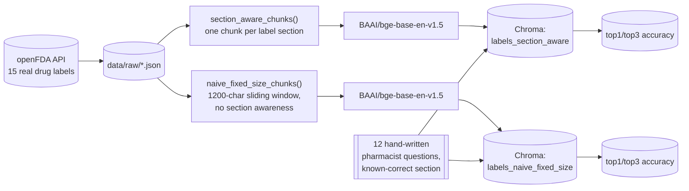

# Task 1 (Day 14), semantic search over real drug labeling data

RxGround indexes real FDA-approved drug labels so a pharmacist could query
them directly instead of digging through PDFs. Phase 4 of the roadmap
(`30-day-ai-ml-roadmap-industry-portfolio.md` at the repo root), following
GridScribe (Phase 3). Own git repo, own virtual environment, own DVC setup.

The data is genuinely public and genuinely current, pulled live from the
**openFDA drug labeling API** (`api.fda.gov/drug/label.json`), free, no API
key required, and safe to use since FDA labels carry no patient information
at all, only manufacturer-submitted prescribing information.

## What this task actually measures

The roadmap's done-when for this day is "you can explain why chunking by
label section retrieves better than naive fixed-size chunking here." Rather
than just asserting that, this builds both chunking strategies over the
same 15 real labels, indexes both, runs the same 12 pharmacist-style
questions against each, and reports the real retrieval accuracy gap.



## Approach

1. **`fetch_labels.py`** pulls 15 real prescription and OTC drug labels
   (Lipitor, a metformin combination, warfarin, lisinopril, amoxicillin,
   and 10 others chosen to cover dosing, interactions, contraindications,
   pregnancy, pediatric use, geriatric use, boxed warnings, and overdose
   content) and saves each raw openFDA JSON response to `data/raw/`,
   unmodified, so chunking can be re-run against the same source without
   re-fetching. DVC-tracked (`data/raw.dvc`).
2. **`schema.py`** defines `LabelChunk`, a Pydantic model with a closed
   `LabelSection` enum (13 real SPL sections openFDA exposes:
   `indications_and_usage`, `dosage_and_administration`,
   `contraindications`, `warnings_and_cautions`, `boxed_warning`,
   `drug_interactions`, `adverse_reactions`, `overdosage`,
   `use_in_specific_populations`, `pregnancy`, `pediatric_use`,
   `geriatric_use`, `description`).
3. **`chunking.py`** builds two chunk sets from the same raw labels:
   - `section_aware_chunks()`: one chunk per populated label section, long
     sections split further at 1200 characters but never across a section
     boundary.
   - `naive_fixed_size_chunks()`: every section concatenated into one blob
     per label, then sliced into 1200-character windows with 150 characters
     of overlap, no regard for where one section ends and the next begins.
     A window's `section` tag is just whichever section it started inside,
     which is itself part of the problem, a window can straddle two
     sections.
4. **`index.py`** embeds both chunk sets with `BAAI/bge-base-en-v1.5`
   (normalized, cosine similarity via inner product) and indexes each into
   its own persistent Chroma collection on disk (`chroma_db/`, gitignored,
   rebuilt from `data/raw` by `index.py`, not itself a source artifact).
5. **`eval_retrieval.py`** runs 12 real questions (see below) against both
   collections and scores top-1 and top-3 accuracy against a known-correct
   `(drug, section)` answer for each.

## Results

Real run, 2026-08-11, `../.venv/bin/python eval_retrieval.py`, full detail
in `outputs/eval_results.json`:

| Chunking strategy | Top-1 accuracy | Top-3 accuracy |
|---|---|---|
| Section-aware | **0.667** (8/12) | **0.833** (10/12) |
| Naive fixed-size | 0.250 (3/12) | 0.500 (6/12) |

Section-aware chunking beats naive fixed-size by **41.7 points at top-1**
and **33.3 points at top-3** on the same 12 questions, same embedding
model, same 15 labels.

**Why, concretely, from the actual misses:**

- Naive fixed-size chunking's failures are not close misses, several
  return the wrong section entirely from windows that blend two sections
  together. The `warfarin drug_interactions` query returned the
  `boxed_warning` section at rank 1 and `drug_interactions` twice in the
  top 3 (two overlapping windows landing on the same section by
  coincidence), while the `Lipitor contraindications` query's third result
  came from a completely different drug (Zocor). A fixed-size window has
  no concept of "this sentence belongs to warnings, not contraindications",
  it just grabs whatever 1200 characters happen to be adjacent.
- Section-aware chunking's 4 misses are a different, much narrower kind of
  error, wrong section but always the correct drug, and usually an
  adjacent, genuinely related section: `pediatric_use` missed to
  `warnings_and_cautions` (which, for Neurontin, does discuss pediatric
  risk), `geriatric_use` missed to `use_in_specific_populations` (the
  parent section geriatric use is drawn from), `warnings_and_cautions`
  missed to `description`, and `boxed_warning` missed entirely for the one
  drug in the set with unusually short boxed-warning text. These are
  believable near-misses a hybrid or reranking step (Day 16) could fix,
  not the "wrong drug, wrong topic" failures naive chunking produces.
- Section-aware chunking guarantees a clean citation: every chunk maps to
  exactly one drug and one real SPL section, so grounding a RAG answer
  ("per the boxed warning for X") is always accurate to point back to.
  Naive chunking cannot make that guarantee, a chunk citing "per the
  warnings section" might actually contain text from contraindications.

## Reproducing

```bash
cd rxground
python3 -m venv .venv
./.venv/bin/pip install -r requirements.txt
cd task-1
dvc pull
../.venv/bin/python fetch_labels.py   # only needed if data/raw is empty, dvc pull already restores it
../.venv/bin/python index.py
../.venv/bin/python eval_retrieval.py
../.venv/bin/python -m pytest tests -q
```
