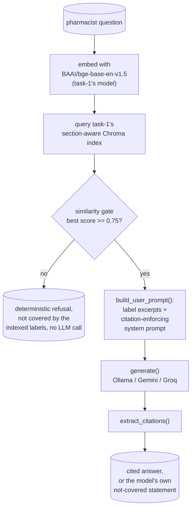

# Task 2 (Day 15), baseline RAG over the indexed drug labels

Retrieve, augment, generate over task-1's already-indexed drug labels, with
a prompt that demands a citation to the specific label section for every
claim, and an explicit refusal when a question is not actually covered by
the indexed labels. This is the roadmap's real Day 15 scope, Baseline RAG,
not a redo of task-1's indexing.

Reuses task-1's Chroma index, embedding model, and Pydantic section schema
directly (`paths.py` adds `../task-1` to `sys.path`), does not rebuild or
duplicate any of it.

## Architecture



## Approach

1. **`retrieve.py`** embeds the question with the same `BAAI/bge-base-en-v1.5`
   model task-1 used, queries task-1's `labels_section_aware` Chroma
   collection, and converts Chroma's raw L2 distance back to cosine
   similarity (`1 - l2_squared / 2`, exact for the unit-normalized vectors
   used throughout this index) so retrieval confidence is one consistent,
   comparable 0 to 1 score.
2. **`prompts.py`** defines the system prompt: answer only from the given
   label excerpts, cite every claim in the exact form
   `(Brand Name, section_name)`, and say plainly that a question is "not
   covered by the indexed labels" if the excerpts do not actually answer
   it.
3. **`rag.py`** enforces "not covered" two independent ways:
   - A **similarity gate** before any LLM call. Below the threshold,
     generation is skipped entirely and a deterministic refusal is
     returned, cheap, fast, and immune to a persuasively-worded question.
   - The **LLM's own instruction-following**, for the case where retrieval
     clears the gate but the specific detail asked for still is not in the
     retrieved excerpts (see the ZITUVIMET renal-dosing example below,
     this genuinely happened).
4. **`generate.py`** is provider-agnostic the same way GridScribe's
   extraction pipeline was: one function per provider (Ollama, Gemini,
   Groq), same signature, swapped by name.

## Retrieval confidence threshold

**0.75**, measured the same way task-1's chunking threshold was, not
guessed. 3 real in-index questions against this index scored a minimum
top-1 cosine similarity of **0.789** (Lipitor contraindications). 4 real
out-of-index questions (asking about aspirin, prednisone, insulin
glargine, and ibuprofen, none of which are indexed here) scored a maximum
top-1 similarity of **0.716** (an aspirin dosing question, which happened
to land near Lopressor's dosing section since both discuss cardiac dosing
in similar language). 0.75 sits in that real gap.

## Results, a real run against Ollama (qwen2.5:7b), 2026-08-12

Full detail in `outputs/eval_results.json`. 10 questions, 8 about drugs
that are indexed, 2 about drugs that are not.

| Metric | Result |
|---|---|
| Similarity gate matched the expected covered/not-covered outcome | **10/10** |
| Out-of-index questions correctly refused | **2/2** |
| In-index questions with the exact requested `(Brand, section)` citation format | 4/8 |
| In-index questions with any traceable citation (requested format, or the label's own `[see ...]` cross-reference style) | 6/8 |

**The citation-format number is the honest, interesting result here.**
qwen2.5:7b was told, every time, to cite in the exact format
`(Brand Name, section_name)`. It only did so literally in half the
answers. Looking at the actual output (`outputs/eval_results.json`):

- For the **Lipitor contraindications** and **ZOCOR warnings** questions,
  the model answered correctly but cited using the label's *own* internal
  cross-reference convention instead, `[see Contraindications (4)]`,
  `[see Warnings and Precautions (5.1)]`. That style is present verbatim
  in the retrieved chunk text (it is how FDA labels cross-reference their
  own sections), and the model echoed it instead of switching to the
  format requested in the system prompt. Still a real, traceable pointer
  back to a label section, just not the format asked for, this is tracked
  separately in `rag.extract_source_style_citations()` rather than
  silently scored as "no citation."
- For the **lisinopril pregnancy** question, the model cited correctly,
  `(Zestril, 8.1 Pregnancy Risk Summary)`, but used the label's real
  subsection title instead of the schema's snake_case section name
  (`pregnancy`), so it did not match the strict regex either. A genuine
  citation, in a third format the eval did not anticipate.
- For the **ZITUVIMET renal-dosing** question, the model gave no citation
  in either style, but it also did something arguably more important: the
  retrieved excerpts covered ZITUVIMET's general max dose but not the
  renal-impairment-specific detail asked for, and the model noticed and
  said so mid-answer ("the specific maximum dose for a patient with renal
  impairment is not directly stated in the provided excerpts... not
  covered by the indexed labels"), even though the similarity gate had
  already let the question through. This is exactly the second layer of
  "not covered" enforcement doing its job, the gate only checks whether
  *some* relevant content exists, not whether the *specific* sub-question
  is actually answered by it.

Gemini (gemini-flash-latest) was run against the same warfarin and aspirin
questions as a live check that the pipeline is genuinely provider-agnostic,
not just coded to look that way. It cited in the exact requested format on
11 separate claims for the warfarin question and correctly refused the
aspirin question through the same similarity gate (provider-independent by
design, the gate runs before any provider is called). Groq is wired
identically but not exercised live, no `GROQ_API_KEY` is set in this
environment, the same gap GridScribe documented.

## Reproducing

Requires task-1's index to already exist (`../task-1/chroma_db/`, built by
`../task-1/index.py`, see `../task-1/README.md` for that one-time step) and
a local Ollama server with `qwen2.5:7b` pulled.

```bash
cd rxground
python3 -m venv .venv
./.venv/bin/pip install -r requirements.txt
cd task-1
../.venv/bin/dvc pull
../.venv/bin/python index.py        # only if chroma_db/ is not already present
cd ../task-2
../.venv/bin/python eval_baseline_rag.py
../.venv/bin/python -m pytest tests -q
```
