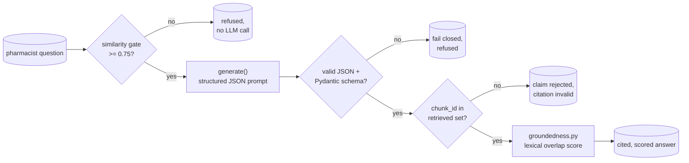

# Task 3, citation-enforced generation with Pydantic-validated claims

## Architecture



Builds the generation layer on top of task-1's index and task-2's baseline
RAG. task-2 already retrieved, generated, and asked for citations in free
text, its own README documents that a regex over free text catches maybe
half of what the model actually cited, because the model does not
reliably follow one exact text format. This task replaces that with
structured JSON output, one claim per factual statement, each claim
carrying a citation to a specific `(set_id, section, chunk_id)`, validated
in two layers before anything is returned to the caller:

1. **Pydantic** (`citation_schema.py`) checks the shape, a non-refused
   response must carry at least one claim, every claim must carry at
   least one citation, a refused response must not carry claims and must
   state a reason. This is necessary but not sufficient, Pydantic can
   confirm a citation has the right shape, it cannot confirm the model
   did not invent a `chunk_id` that merely looks real.
2. **A cross-check against the actual retrieved chunks** (`rag_grounded.
   _validate_claim_citations`) confirms every cited `chunk_id` was one of
   the chunks genuinely retrieved for this question, and that its
   `set_id`/`section` match. This is the layer that caught the real
   failure mode described below.

Any response that is not valid JSON, or fails Pydantic validation, fails
**closed** to a refusal rather than being passed through as if it were a
real answer, this is the actual safety property task-3 exists to build,
see `rag_grounded.answer_question`.

## Groundedness check

A lexical overlap heuristic (`groundedness.py`), not a second LLM call.
`score(claim) = ` fraction of the claim's significant words (stopwords
and punctuation stripped) that also appear in the text of the chunk(s) it
cites. Chosen over LLM-as-judge because the exact failure being checked
for, a claim's own text saying something its cited chunk does not
contain, is a fact a second LLM call could just as easily rubber-stamp as
the first one hallucinated, a deterministic word-overlap score cannot be
talked into agreeing with a fabricated claim. A claim whose citation is
already invalid is scored 0.0 rather than measured against a chunk it was
never really pointing at. A refusal is scored 1.0 by convention, there is
nothing to hallucinate.

## Real eval results, 18 questions, live run against Ollama (qwen2.5:7b), 2026-08-13

Full detail in `outputs/eval_results.json`, table in
`outputs/eval_results.md`. 7 answerable, 6 ambiguous or partially
covered, 5 out of scope (4 drugs never indexed here, plus one
false-premise question about a Lipitor/levothyroxine interaction the
label does not describe).

| Metric | Result |
|---|---|
| Refusal correctness (answerable + out-of-scope questions, the two categories with an unambiguous expected outcome) | **10/10 = 1.0** |
| Mean citation validity on answered (non-refused) questions | **0.556** |
| Mean groundedness score, all 18 questions | **0.749** |
| Parse failures (invalid JSON, failed closed to refusal) | **0/18** |

Every out-of-scope question, including the false-premise one, was
correctly refused, and every clearly answerable question was answered
rather than refused. The interesting, honest number is citation
validity, only 55.6% of claims on answered questions carried a citation
that survived the cross-check against real retrieved chunk_ids, even
though the eval's JSON never failed to parse. See below for why.

## The real failure mode citation validation caught

For the Norvasc dosing question (q04), the model's answer content was
correct:

> "The usual initial antihypertensive oral dose of Norvasc is 5 mg once
> daily."

which matches the real retrieved `dosage_and_administration` chunk
verbatim. But it cited `chunk_id: "7367289c-...-c29f:0"`, the correct
`set_id`, a plausible-looking suffix, and the wrong chunk_id, the real
retrieved id for that chunk was
`"7367289c-...-c29f:dosage_and_administration:0"`. The model was told
the exact chunk_id string in the excerpt block and still did not copy it
verbatim, it reconstructed a shorter id that looks like the real
convention but is not one. The same pattern repeated on q07 (Neurontin
pediatric dosing) and two ambiguous questions.

This is the actual point of the second validation layer. **Getting the
right answer is not the same thing as citing it correctly.** A regex or
a Pydantic shape check alone would have accepted this claim, it is
syntactically a well-formed citation. Only checking it against the real
set of retrieved chunk_ids catches that the id does not exist. Every one
of these cases was still scored as citation-invalid and groundedness-0.0
by this pipeline, on purpose, a plausible-looking but fabricated pointer
is not a citation.

Gemini (gemini-flash-latest), run against the same Lipitor contraindications
question, produced two claims, both with valid citations against the real
retrieved chunk_ids, confirming the pipeline is genuinely provider-agnostic
and that the citation-fabrication failure mode above is not universal
across providers, it was observed live, on qwen2.5:7b specifically. Groq
is wired identically (`generate.py`, reused unchanged from task-2) but not
exercised live here, no `GROQ_API_KEY` is set in this environment, the
same documented gap as task-2 and GridScribe.

## Deliberate failure exercise, citation-enforced versus unenforced

`failure_exercise.py` retrieves the same context once per question and
sends it to two prompt variants, `SYSTEM_PROMPT_ENFORCED` (structured
JSON, citation required, the pipeline above) and
`SYSTEM_PROMPT_UNENFORCED` (plain prose, no citation requirement, no
schema). Full output in `outputs/failure_exercise.json`.

**The real, observed difference, on the aspirin dosing question (aspirin
is not indexed here):**

- **Enforced pipeline:** refused. Best retrieved similarity 0.740, below
  the 0.75 gate, `"not covered by the indexed labels"`. No LLM call for
  content was even attempted past the gate.
- **Unenforced pipeline, same retrieved context** (the top hits were
  Warfarin Sodium chunks discussing aspirin only as a co-administered
  drug):

  > "For patients with non-valvular atrial fibrillation (AF), the label
  > recommends using warfarin in combination with low-dose aspirin...
  > Concurrent use of low-dose aspirin (≤ 100 mg/day)... the document does
  > not specify a separate dose for atrial fibrillation alone."

  This reads as a direct answer to "what is the recommended dose of
  aspirin," confidently stated, plausible, and built entirely from the
  **Warfarin** label's guidance about combining warfarin with low-dose
  aspirin, not an aspirin dosing recommendation at all. Nothing in this
  response signals that aspirin itself is not an indexed drug here. A
  pharmacist skimming this would reasonably read it as a real answer.

**On the false-premise question** (`Does Lipitor have a documented
interaction with levothyroxine that causes serotonin syndrome?`), the
unenforced path did not fabricate here, it correctly stated no such
interaction is documented in the excerpts. So the unenforced path is not
uniformly unsafe, it is uninformative for retrieval calibration, it gives
no signal for when the underlying retrieval was too weak to trust, which
is exactly what the similarity gate and citation cross-check exist to
catch, and did catch, on the aspirin question.

## Files

| File | What it does |
|---|---|
| `citation_schema.py` | `Citation`, `Claim`, `GroundedResponse` Pydantic models, structural validation of the LLM's JSON output |
| `retrieve_with_ids.py` | Same retrieval as task-2, extended to also return each chunk's `chunk_id` |
| `prompts.py` | `SYSTEM_PROMPT_ENFORCED` (structured JSON, citation required) and `SYSTEM_PROMPT_UNENFORCED` (plain prose, for the failure exercise) |
| `groundedness.py` | Lexical overlap heuristic, per-claim and per-answer groundedness score |
| `rag_grounded.py` | Orchestrates retrieve, similarity gate, generate, JSON parse, Pydantic validation, citation cross-check, groundedness scoring |
| `data/eval_queries.json` | 18 pharmacist-style questions, 3 categories, DVC-tracked |
| `run_eval.py` | Runs the full pipeline against the eval set, writes `outputs/eval_results.json` and `.md` |
| `failure_exercise.py` | Citation-enforced versus unenforced comparison on 4 real questions, writes `outputs/failure_exercise.json` |
| `outputs/` | Real, measured results, DVC-tracked |

## Reproducing

Requires task-1's index (`../task-1/chroma_db/`) already built, and a
local Ollama server with `qwen2.5:7b` pulled.

```bash
cd rxground
python3 -m venv .venv
./.venv/bin/pip install -r requirements.txt
cd task-1
../.venv/bin/dvc pull
../.venv/bin/python index.py        # only if chroma_db/ is not already present
cd ../task-3
../.venv/bin/python -m pytest tests -q
../.venv/bin/python run_eval.py ollama
../.venv/bin/python failure_exercise.py ollama
```
