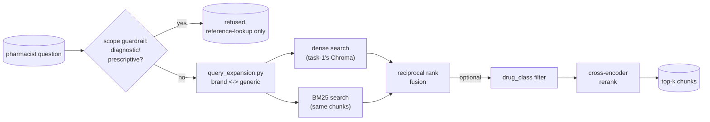

# Task 4, advanced retrieval: hybrid search, reranking, query expansion, drug-class filtering

## Architecture



Builds on task-1's index directly, no rebuild, and adds the retrieval
pipeline the roadmap calls "Advanced retrieval": hybrid search (BM25 plus
dense vectors), a cross-encoder reranker, query expansion for brand and
generic drug names, metadata filtering by drug class, plus a scope
guardrail carried over from the roadmap's anti-hallucination task (see
"Scope guardrail" below for why it landed here instead).

## Why hybrid search at all

Every drug label's `dosage_and_administration` section reads in almost
the same shape, "recommended starting dose is X mg once daily," no matter
which drug it is. That means the *phrasing* of a dosage question is
nearly identical across all 15 indexed drugs, and a purely semantic
(dense) search can end up ranking the wrong drug's dosing section highly
because the sentence structure matches well, even though the one word
that actually matters, the drug's name, does not. BM25 scores exact term
overlap and does not blur "Norvasc" into "Lipitor" the way a dense
embedding can.

`hybrid_retrieve.py` runs both searches (BM25 over the same
section-aware chunks task-1 already built, dense vector search against
task-1's Chroma collection, unchanged) and combines them with
**reciprocal rank fusion (RRF)**: `score(chunk) = sum(1 / (60 + rank))`
across every ranked list the chunk appears in. RRF was chosen over a
weighted score blend because BM25 scores and cosine similarity live on
completely different, incomparable scales, RRF only needs each list's
rank, not its raw score.

## Cross-encoder reranking

`rerank.py` runs `cross-encoder/ms-marco-MiniLM-L-6-v2` (Hugging Face,
free) over the RRF-fused candidate pool, scoring the query and each
candidate's full text together in one pass rather than comparing
independent embeddings.

## Query expansion

`query_expansion.py` recognizes a known brand or generic name in the
query (matched on the brand's first word, `drug_classes.py` documents
why) and appends the counterpart name(s) if they are not already present,
so a query that only says "Lipitor" also reaches chunks that mostly say
"atorvastatin," and vice versa.

## Metadata filtering by drug class

openFDA's own `pharm_class_epc` field, the obvious source for "drug
class," is present for only **4 of the 15** labels indexed here
(ZITUVIMET, Advil Dual Action, Lasix, ZOCOR), too sparse to filter on
directly. `drug_classes.py` is a small curated table (standard
pharmacology classification: statin, ACE inhibitor, ARB, beta blocker,
and so on) so every one of the 15 drugs has a class, used by
`hybrid_search(..., drug_class=...)` to restrict retrieval to, for
example, only statins.

## Scope guardrail

The roadmap's Task 5 (anti-hallucination, grounding, guardrails) asks for
a "scope guardrail keeping RxGround at reference-lookup, never diagnostic
or prescriptive advice." Task 3 already built the citation-and-refusal
half of that task, this is the missing half, and it landed here rather
than in a dedicated task because it belongs conceptually at the front of
retrieval: it decides whether a question should be answered from the
index **at all**, before any embedding, BM25 lookup, or reranking runs.

`scope_guardrail.py` is a pattern-matching heuristic, not an LLM call,
same reasoning as task-3's groundedness check: the failure being guarded
against, giving a real person medical advice about their own body, is too
high-stakes to depend on a second model call correctly noticing it every
time. Its honest limitation, documented rather than hidden: it is
surface-level phrase matching, not language understanding, a rephrased
question with the same intent can slip through, and a legitimate
third-person reference question can occasionally share phrasing with a
flagged pattern. See `tests/test_scope_guardrail.py` for both a case it
correctly catches and a case it correctly leaves alone.

## Real eval results: hybrid + rerank versus naive dense-only

`eval_retrieval_comparison.py`, 18 queries: the same 12 general
pharmacist-style questions task-1 used, plus 6 new questions written
specifically to stress the exact-dosage failure mode described above.
Full detail in `outputs/eval_results.json`.

| Metric | Naive dense-only | Hybrid + rerank |
|---|---|---|
| Top-1 accuracy (18 queries) | 0.722 | **0.778** |
| Top-3 accuracy (18 queries) | **0.889** | 0.833 |
| Top-1 accuracy, exact-dosage queries only (6) | 0.833 | 0.833 |

**The honest result: hybrid + rerank is a net improvement, not a clean
win.** Top-1 accuracy improved, hybrid fixed two questions naive missed
(a Neurontin pediatric-use question, and a COZAAR exact-dosage question).
But top-3 accuracy dropped, because hybrid + rerank introduced one new
regression naive did not have.

**The regression, traced to the actual cause:** for "What dosing
considerations exist for elderly geriatric patients taking losartan,
COZAAR," naive dense search ranked the correct COZAAR `geriatric_use`
chunk at dense rank 2 (a real top-3 hit). In the hybrid pipeline, that
same chunk's BM25 rank was **outside the top 20** entirely (its own
section text says "Of the total number of patients receiving COZAAR in
controlled clinical studies... 391 patients (19%) were 65 years and
older," it does not repeat generic terms like "elderly" or "geriatric"
much beyond the section heading, so BM25 does not score it highly against
those query words). It survived into the reranker's candidate pool only
on the strength of its dense rank, RRF-ranked 13th out of 20 candidates.
The reranker then scored a **different drug's** `geriatric_use` chunk
(Lasix) above it, because that chunk's wording happened to overlap the
query's generic phrasing ("elderly patients," dosing language) more
strongly, and the cross-encoder is not given the drug name as a separate
signal, only the raw chunk text. The correct chunk was pushed out of the
final top 3 by two other COZAAR sections plus the wrong-drug chunk.

This is the real, measured shape of the tradeoff: hybrid + rerank is a
genuine improvement on exact-name matching, but a small reranker can
still promote a wrong-drug chunk with strong topical overlap over the
right drug's own chunk when that chunk's own wording doesn't repeat the
generic query terms, exactly the kind of regression a real eval catches
before it ships. No parameters were tuned after seeing this result to
make the numbers look better, it is reported as measured.

## Files

| File | What it does |
|---|---|
| `hybrid_retrieve.py` | BM25 index over task-1's chunks, dense search against task-1's Chroma collection, `reciprocal_rank_fusion()` (pure, unit tested), drug-class filtering |
| `rerank.py` | Cross-encoder reranking of the fused candidate pool |
| `query_expansion.py` | Brand/generic name expansion |
| `drug_classes.py` | Curated brand-to-class and brand-to-generic lookup tables |
| `scope_guardrail.py` | Diagnostic/prescriptive question detection, runs before retrieval |
| `advanced_retrieve.py` | Orchestrates guardrail, expansion, hybrid search, and reranking into one call |
| `eval_retrieval_comparison.py` | Naive dense-only versus hybrid + rerank, 18 real queries |
| `outputs/eval_results.json` | Real, measured results, DVC-tracked |

## Reproducing

Requires task-1's index (`../task-1/chroma_db/`) already built.

```bash
cd rxground
python3 -m venv .venv
./.venv/bin/pip install -r requirements.txt
cd task-1
../.venv/bin/dvc pull
../.venv/bin/python index.py        # only if chroma_db/ is not already present
cd ../task-4
../.venv/bin/python -m pytest tests -q
../.venv/bin/python eval_retrieval_comparison.py
```
