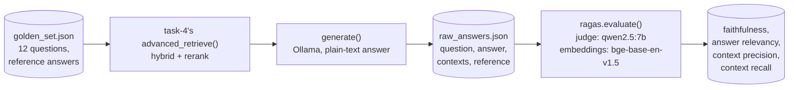

# Task 5, RAG evaluation with RAGAS

## Architecture



Generation (`generate_answers.py`) and scoring (`run_ragas_eval.py`) are
deliberately separate scripts. Generating the 12 answers needs Ollama and
the local index, scoring them needs RAGAS's own, separate, heavy
dependency chain (`datasets`, `langchain`). Splitting them means
re-scoring already-generated answers never needs to re-run generation.

## Retrieval and generation under test

Retrieval is task-4's `advanced_retrieve()`, the best retrieval pipeline
built so far (hybrid search plus reranking). Generation is a plain-text
prompt (`generate_answers.py`'s own, simpler than task-3's structured,
citation-enforced one, RAGAS's faithfulness metric needs free-text
claims to decompose, not a JSON citation structure) over Ollama
(qwen2.5:7b).

## Provider-agnostic judge, consistent with the rest of this repo

RAGAS needs an LLM to act as judge (decomposing answers into claims for
faithfulness, generating synthetic questions for answer relevancy) and an
embedding model (for the cosine-similarity legs of answer relevancy and
context precision/recall). Both are wired through RAGAS's LangChain
wrappers rather than RAGAS's OpenAI default: **Ollama (qwen2.5:7b)** as
the judge LLM, and **BAAI/bge-base-en-v1.5**, the same embedding model
task-1 already uses for the index, as the embeddings. No OpenAI key
needed anywhere in this repo, consistent with every prior task.

## Real results, 12 golden questions, live run

Full detail in `outputs/ragas_results.json`. These are the roadmap's
literal four metrics, RAGAS's real implementations, not a rebuilt
approximation.

| Metric | Mean (12 questions) |
|---|---|
| Faithfulness | 0.877 |
| Answer relevancy | 0.758 |
| Context precision | 0.688 |
| Context recall | 0.917 |

## The honest finding: a small local judge model produces noisy, not just low, scores

Three questions scored **0.0** on some metric, and in every case the
actual answer was correct on inspection, not a real pipeline failure:

- **"What is the boxed warning for... ZITUVIMET"** scored
  **faithfulness = 0.0**. The real answer: *"The boxed warning for
  ZITUVIMET pertains to lactic acidosis."* That is factually correct and
  directly supported by the retrieved `boxed_warning` chunk (confirmed
  against the same label text task-1 indexed). RAGAS's faithfulness
  metric decomposes an answer into atomic claims and asks the judge LLM
  whether each claim is entailed by the context, a short, compressed
  claim like this one is exactly the shape a smaller local judge model
  can misjudge.
- **"How should furosemide, Lasix, be dosed"** and **"Can children
  safely take gabapentin, Neurontin"** both scored **answer relevancy =
  0.0**. Both answers, read directly, are detailed, correct, and
  squarely on-topic (Lasix's actual dosing numbers, Neurontin's actual
  pediatric guidance). Answer relevancy works by having the judge LLM
  generate synthetic questions from the answer, then measuring embedding
  similarity back to the real question, a step that depends on the judge
  reliably producing well-formed synthetic questions, which qwen2.5:7b
  does not always do.

**This is a real, useful, and slightly uncomfortable result to report
honestly: a RAGAS score is only as reliable as its judge model.** RAGAS
was validated in its own published work against large proprietary
judges. Run with a free, local, 7B judge instead (the choice every other
provider-agnostic piece of this repo makes, for the same zero-cost
reason), some fraction of the score is judge noise, not pipeline signal.
The roadmap's done-when for this task, "point to a faithfulness score and
improve it independently of retrieval quality," is still achievable, the
0.877 mean faithfulness is a real, reproducible number given this exact
judge, it just needs reading with the judge's own reliability as part of
the story, not as ground truth.

**One score is genuinely retrieval signal, not judge noise:** the
COZAAR geriatric-use question scored context precision = 0.0 and context
recall = 0.0, the same query task-4's README already documents as a real
reranker regression (a wrong-drug chunk outranked the correct COZAAR
chunk). That is retrieval actually failing, not the judge misreading a
correct answer, and RAGAS's context metrics catch it independently of
faithfulness or relevancy, exactly the "improve it independently of
retrieval quality" property the roadmap asks for: task-5's context
precision/recall scores are what would tell you retrieval regressed even
if generation still produced a plausible-sounding answer from whatever
it got.

## Files

| File | What it does |
|---|---|
| `data/golden_set.json` | 12 pharmacist-style questions with known-correct `(set_id, section)` and a reference answer grounded in real label text, DVC-tracked |
| `generate_answers.py` | Runs task-4's retrieval plus a plain-text generation prompt over the golden set |
| `run_ragas_eval.py` | Scores `outputs/raw_answers.json` with real RAGAS metrics |
| `outputs/raw_answers.json`, `outputs/ragas_results.json` | Real, measured results, DVC-tracked |

## A real upstream compatibility issue, worked around

`ragas` (0.3.9, and every 0.4.x release as of this writing) unconditionally
imports `ChatVertexAI` from `langchain_community.chat_models.vertexai` at
import time. `langchain-community` has since removed that submodule as
part of its own migration to standalone integration packages, so this
import fails on any currently-installable `langchain-community` version,
independent of which ragas version is pinned, a real upstream
incompatibility, not a mistake in this project's own pinning. This
project never uses Vertex AI (Ollama, Groq, and Gemini are the three
providers everywhere in this repo), so `run_ragas_eval.py` installs a
minimal stub module satisfying the import before importing `ragas`, not
a functional stand-in for real Vertex AI support, just enough to let
import succeed.

## Reproducing

Requires task-1's index and task-4's retrieval pipeline already working,
and a local Ollama server with `qwen2.5:7b` pulled. `ragas`'s own
dependency chain (`langchain`, `datasets`) is large, installing it is the
slowest step here by far.

```bash
cd rxground
python3 -m venv .venv
./.venv/bin/pip install -r requirements.txt
cd task-1
../.venv/bin/dvc pull
../.venv/bin/python index.py        # only if chroma_db/ is not already present
cd ../task-5
../.venv/bin/python -m pytest tests -q
../.venv/bin/python generate_answers.py ollama
../.venv/bin/python run_ragas_eval.py
```
