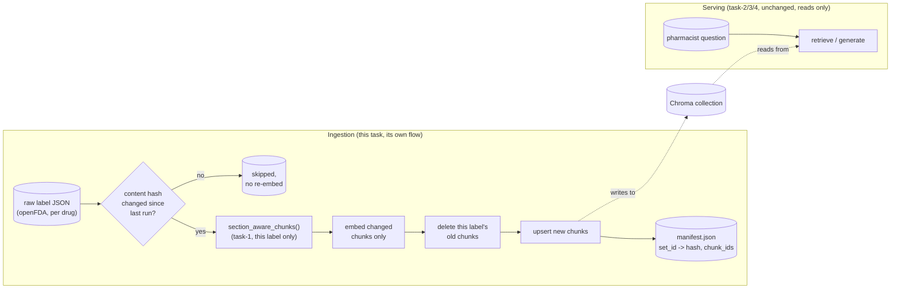

# Task 6, production RAG architecture: ingestion separated from serving

## Architecture



Every prior RxGround task (2, 3, 4) reads a Chroma collection and never
writes to one. This task is the one place that writes, and it runs as an
independent **Prefect** flow, on its own schedule or trigger, entirely
decoupled from any query being served. That separation is the actual
point: a label revision mid-ingestion never blocks or slows a live
pharmacist query, and a query never accidentally triggers a re-embed.

## Why incremental, not a full rebuild

Real openFDA data changes constantly, label revisions, black-box warning
updates, and recalls all happen on an ongoing basis. Re-embedding and
re-indexing all 15 (or, in production, thousands of) labels every time
one of them changes does not scale and makes "how current is this index"
an expensive question to keep answering. `manifest.py` tracks a SHA-256
content hash per label (`set_id -> hash, chunk_ids, last_ingested_at`).
`ingestion_flow.ingest_one()` only rechunks, re-embeds, and
deletes-and-replaces Chroma entries for a label whose hash actually
changed, every other label's vectors are left untouched. `ingest_all()`
loops the same logic over every label, that is the manual backfill path,
always safe to run since unchanged labels are skipped automatically
rather than needlessly re-processed.

Retries are handled at the Prefect task level (`@task(retries=3,
retry_delay_seconds=2)` on the network-shaped steps, loading a raw label
and calling the embedding model), so a transient failure on one label
does not need the whole backfill re-run from scratch.

## The real, measured simulation

`simulate_revision.py` runs the actual scenario the roadmap's done-when
asks for, entirely against task-6's own copy of the index
(`chroma_db/labels_section_aware_v2`, seeded from task-1's real raw
labels), never against task-1's own collection every other task reads
from.

1. **Seed**: `ingest_all()` against all 15 real labels, fresh state. All
   15 are new, all 15 get ingested.
2. **Idempotency check**: run `ingest_all()` again, same source. Nothing
   changed, every content hash matches the manifest, all 15 are skipped,
   confirmed by comparing hashes before and after, not just trusting a
   skip counter.
3. **Simulate a revision**: a modified copy of ZITUVIMET's raw label with
   a sentence appended to its `boxed_warning` section (a realistic
   openFDA event, a postmarketing safety update), every other byte, and
   every other one of the 15 labels, untouched.
4. **Re-run ingestion** against the revised set.
5. **Verify**, not assume: query the collection directly for ZITUVIMET's
   `boxed_warning` chunk and confirm the new sentence is actually
   retrievable, and confirm an unrelated label's chunk_ids are
   byte-identical to what they were before the revision.

Real output, `outputs/simulation_results.json`:

| Check | Result |
|---|---|
| Labels ingested on initial seed | 15 / 15 |
| All 15 hashes unchanged on idempotent re-run | confirmed |
| Labels re-ingested after the simulated revision | exactly 1 (ZITUVIMET) |
| Revised text ("acute pancreatitis") retrievable from the collection | confirmed |
| An unrelated label's chunk_ids unchanged after the revision | confirmed |

This is the actual claim task-6 exists to prove: a label revision is
reflected in retrieval, and only that label's vectors were ever touched
to make it happen.

## A real bug this simulation caught

The first version of `ingest_one()` mutated the `manifest` dict it was
passed and relied on the caller (`ingest_all()`) seeing that mutation.
Prefect validates and copies flow parameters at the subflow boundary, so
the mutation happened to a copy, `ingest_all()`'s own `manifest` came
back empty, "seeded 0 labels," even though every individual `ingest_one`
subflow logged a real "ingested" line. The fix, `ingest_one()` returns
`(set_id, entry)` instead of mutating a shared dict, and `ingest_all()`
assigns `manifest[set_id] = entry` itself, in its own scope. A second,
separate bug in the verification step itself, `_query_boxed_warning()`
originally checked only the first chunk Chroma returned for the
`boxed_warning` section, but that section splits into 3 chunks
(`MAX_CHUNK_CHARS` in task-1's `chunking.py`) and the added sentence
landed in the third one, so the first run reported
`"revision_visible_in_retrieval": false` even though the ingestion itself
had worked correctly. Both are documented here because they are exactly
the kind of subtle, real failure a "trust the log line" approach misses,
and an actual query against real retrieved data catches.

## Files

| File | What it does |
|---|---|
| `manifest.py` | Content-hash tracking per label, pure functions, unit tested without Prefect or Chroma |
| `ingestion_flow.py` | Prefect `@flow`/`@task` ingestion, `ingest_one()` and `ingest_all()` (the backfill path) |
| `simulate_revision.py` | The real, measured revision simulation described above |
| `outputs/simulation_results.json` | Real, measured results, DVC-tracked |

## Reproducing

```bash
cd rxground
python3 -m venv .venv
./.venv/bin/pip install -r requirements.txt
cd task-1
../.venv/bin/dvc pull
cd ../task-6
../.venv/bin/python -m pytest tests -q
../.venv/bin/python simulate_revision.py
```
